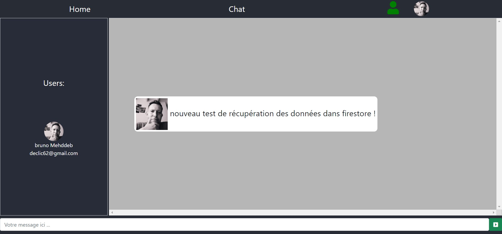

# A test project for an API that will be useful in a future mobile application

I'm working right now on this project for
testing use firebase serverless in a futur mobile app,

I'ld like add firestore instead of websockets for log the user messages
and to late, use firebase database for store their data like images, files ...
## and so on ...

### <code>" my life is a giant test 😶 " ...</code>

# <h1 style="color: red">Warning⚠️</h1>

## in my humble opinion do what google says and prefer to use firestore instead of real time database, because it's more practical and simpler to used !
